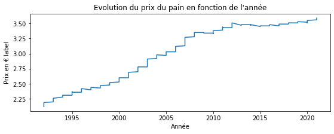
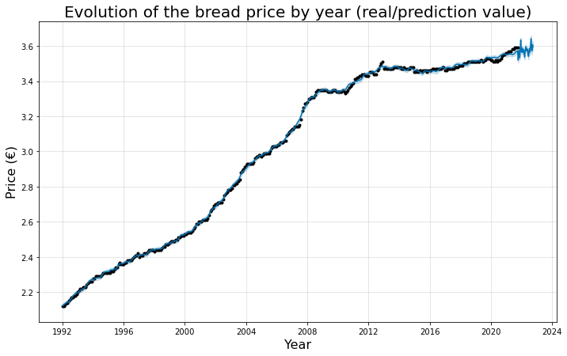
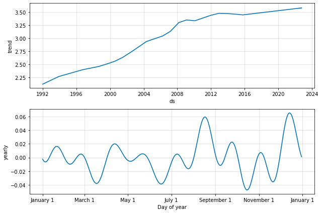

# Analyse and forescast bread price in France
 

## Table of Contents
1. [General Info](#general-info)
2. [Graphics](#result)

## General Info
This project consist to analyse and predict the future price of the bread in France.
For my prediction I use [Prophet](https://github.com/facebook/prophet) released by Facebook's Core Data Science team.

## Result
This firt graph show the evolution of the bread

The second graph show the actual and predicted value

The third graph show the components extract (trend)

This table shows 3 the forescast by table

 Year | Forescast | Lower forescast | Upper forescast |
 --- | --- | --- |--- |
2022-09-27 | 3.604286 | 3.582768 | 3.625472 |
2022-09-28 | 3.602145 | 3.581696 | 3.623564 |
2022-09-29 | 3.599355 | 3.578212 | 3.619997 |

<b> Interpretation line 1 : On September 27, 2022 the price of bread will be 3.60 € in France </b>
